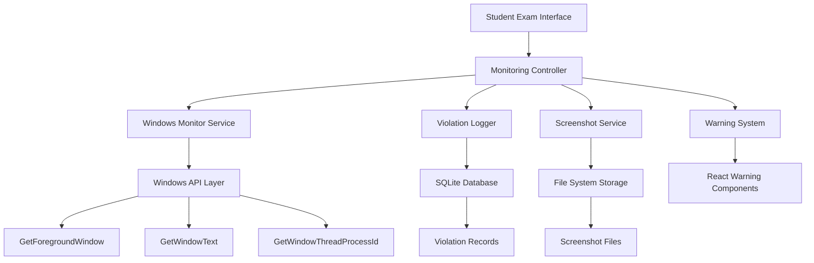

# Design Document

## Overview

The exam application monitoring system is a Windows-native service that integrates with the existing LAB-Guard Electron application to provide real-time monitoring of student application usage during exams. The system uses Windows APIs to detect active applications, compares them against teacher-defined allowed applications, and captures evidence of violations through screenshots and detailed logging.

## Architecture

### High-Level Architecture



### Component Integration

The monitoring system integrates with existing LAB-Guard components:

- **Main Process (Electron)**: Hosts the monitoring service and provides IPC communication
- **Database Service**: Extended to store violation records and monitoring events
- **Student Dashboard**: Enhanced with warning log cards and monitoring status
- **File Service**: Extended to handle screenshot storage and retrieval

## Components and Interfaces

### 1. Windows Monitor Service

**Location**: `services/windowsMonitor.js`

**Responsibilities**:
- Continuously poll active window information using Windows APIs
- Detect application focus changes
- Compare active applications against allowed list
- Emit events for violations and status changes

**Key Methods**:
```javascript
class WindowsMonitorService {
  constructor(allowedApps, onViolation, onStatusChange)
  startMonitoring()
  stopMonitoring()
  getCurrentActiveApp()
  isAppAllowed(appName)
}
```

**Windows API Integration**:
- Uses `ffi-napi` or `node-ffi` for Windows API calls
- Primary APIs: `GetForegroundWindow()`, `GetWindowText()`, `GetWindowThreadProcessId()`
- Polling interval: 1000ms (configurable)

### 2. Screenshot Service

**Location**: `services/screenshotService.js`

**Responsibilities**:
- Capture screenshots of active windows when violations occur
- Save screenshots with organized naming convention
- Handle screenshot failures gracefully
- Manage screenshot file cleanup

**Key Methods**:
```javascript
class ScreenshotService {
  constructor(storageBasePath)
  captureActiveWindow(examId, studentId, appName)
  getScreenshotPath(examId, studentId, timestamp)
  cleanupOldScreenshots(examId)
}
```

**Storage Structure**:
```
screenshots/
├── exam-{examId}/
│   ├── student-{studentId}/
│   │   ├── violation-{timestamp}-{appName}.png
│   │   └── violation-{timestamp}-{appName}.png
```

### 3. Monitoring Controller

**Location**: `services/monitoringController.js`

**Responsibilities**:
- Orchestrate monitoring workflow
- Manage monitoring state and lifecycle
- Coordinate between monitor, screenshot, and logging services
- Handle error recovery and service restarts

**Key Methods**:
```javascript
class MonitoringController {
  constructor(dbService, screenshotService)
  startExamMonitoring(examId, studentId, allowedApps)
  stopExamMonitoring()
  handleViolation(violationData)
  handleMonitoringError(error)
}
```

### 4. Violation Logger

**Location**: Integrated into existing `DatabaseService`

**New Database Schema**:
```sql
CREATE TABLE app_violations (
  violation_id TEXT PRIMARY KEY,
  exam_id TEXT NOT NULL,
  student_id TEXT NOT NULL,
  device_id TEXT NOT NULL,
  app_name TEXT NOT NULL,
  window_title TEXT,
  focus_start_time DATETIME NOT NULL,
  focus_end_time DATETIME,
  duration_seconds INTEGER,
  screenshot_path TEXT,
  screenshot_captured INTEGER DEFAULT 0,
  created_at DATETIME DEFAULT CURRENT_TIMESTAMP,
  FOREIGN KEY (exam_id) REFERENCES exams (exam_id),
  FOREIGN KEY (student_id) REFERENCES users (user_id)
);
```

**New Methods**:
```javascript
// Added to DatabaseService
logAppViolation(violationData)
updateViolationEndTime(violationId, endTime)
getViolationsByExam(examId)
getViolationsByStudent(studentId, examId)
```

### 5. Warning System Components

**Frontend Components**:

**WarningLogCard** (`src/components/WarningLogCard.tsx`):
```typescript
interface WarningLogCardProps {
  violation: {
    violationId: string;
    appName: string;
    windowTitle: string;
    focusStartTime: string;
    focusEndTime?: string;
    duration?: number;
    isActive: boolean;
  };
}
```

**WarningPanel** (`src/components/WarningPanel.tsx`):
- Container for multiple warning log cards
- Real-time updates via IPC events
- Scrollable interface for multiple violations

## Data Models

### Violation Record Model

```typescript
interface ViolationRecord {
  violationId: string;
  examId: string;
  studentId: string;
  deviceId: string;
  appName: string;
  windowTitle: string;
  focusStartTime: Date;
  focusEndTime?: Date;
  durationSeconds?: number;
  screenshotPath?: string;
  screenshotCaptured: boolean;
  createdAt: Date;
}
```

### Monitoring State Model

```typescript
interface MonitoringState {
  isActive: boolean;
  examId: string;
  studentId: string;
  allowedApps: string[];
  currentApp?: string;
  activeViolations: Map<string, ViolationRecord>;
  totalViolations: number;
  monitoringStartTime: Date;
}
```

### Screenshot Metadata Model

```typescript
interface ScreenshotMetadata {
  filePath: string;
  fileName: string;
  captureTime: Date;
  fileSize: number;
  appName: string;
  windowTitle: string;
}
```

## Error Handling

### Windows API Failures

**Strategy**: Graceful degradation with fallback mechanisms

1. **Primary Detection Failure**: If `GetForegroundWindow()` fails, attempt alternative detection methods
2. **Permission Issues**: Detect UAC/permission problems and provide clear user guidance
3. **API Unavailability**: Log errors and continue with reduced functionality

**Implementation**:
```javascript
try {
  const activeWindow = this.getActiveWindow();
  return this.processWindowInfo(activeWindow);
} catch (error) {
  this.logger.error('Windows API call failed:', error);
  return this.fallbackDetection();
}
```

### Screenshot Capture Failures

**Strategy**: Continue monitoring even if screenshots fail

1. **Disk Space Issues**: Check available space before capture
2. **Permission Problems**: Handle file system access errors
3. **Capture Failures**: Log failure but maintain violation record

### Service Recovery

**Strategy**: Automatic restart with exponential backoff

1. **Monitor Service Crashes**: Detect and restart monitoring service
2. **Database Connection Loss**: Reconnect with retry logic
3. **Resource Exhaustion**: Implement resource monitoring and cleanup

## Testing Strategy

### Unit Testing

**Windows Monitor Service Tests**:
- Mock Windows API responses
- Test application detection logic
- Verify allowed/disallowed app classification
- Test polling interval and performance

**Screenshot Service Tests**:
- Mock screenshot capture functionality
- Test file naming and storage logic
- Verify error handling for capture failures
- Test cleanup operations

**Database Integration Tests**:
- Test violation record creation and updates
- Verify foreign key constraints
- Test query performance with large datasets
- Validate data integrity

### Integration Testing

**End-to-End Monitoring Flow**:
1. Start exam monitoring
2. Simulate application focus changes
3. Verify violation detection and logging
4. Confirm screenshot capture
5. Validate warning display
6. Test monitoring stop

**Cross-Component Communication**:
- Test IPC communication between main and renderer processes
- Verify real-time updates to warning components
- Test error propagation and handling

### Performance Testing

**Resource Usage Monitoring**:
- CPU usage during continuous monitoring
- Memory consumption over extended periods
- Disk I/O impact from screenshot capture
- Network impact (should be minimal)

**Scalability Testing**:
- Multiple concurrent exam monitoring sessions
- Large numbers of violations and screenshots
- Database performance with extensive violation history

### Security Testing

**Permission and Access Control**:
- Verify student cannot disable monitoring
- Test screenshot file access restrictions
- Validate violation record integrity
- Test against tampering attempts

**Privacy Compliance**:
- Ensure only active window screenshots (not full screen)
- Verify secure storage of violation evidence
- Test data cleanup and retention policies

## Implementation Phases

### Phase 1: Core Windows Monitoring
- Implement Windows API integration
- Create basic application detection
- Set up violation detection logic

### Phase 2: Database and Logging
- Extend database schema for violations
- Implement violation logging service
- Create data retrieval methods

### Phase 3: Screenshot Capture
- Implement screenshot service
- Set up file storage organization
- Handle capture error scenarios

### Phase 4: Frontend Integration
- Create warning log card components
- Implement real-time violation display
- Add monitoring status indicators

### Phase 5: Error Handling and Polish
- Implement comprehensive error handling
- Add service recovery mechanisms
- Performance optimization and testing