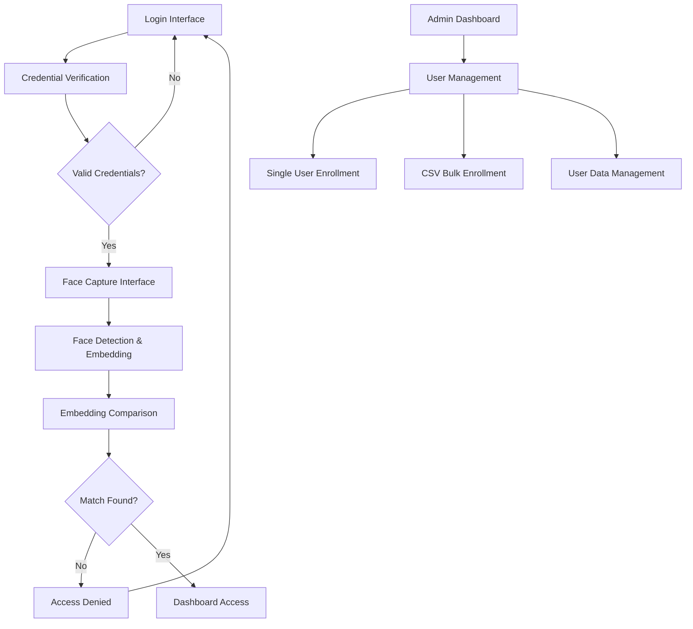
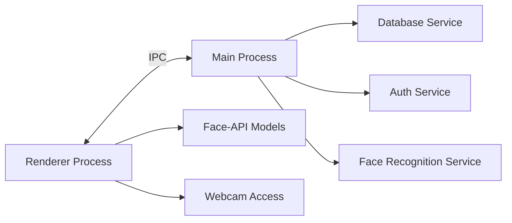

# Design Document

## Overview

The 2FA face recognition system is designed as a modular Electron.js application that integrates traditional password authentication with biometric face verification. The system uses @vladmandic/face-api for face detection and recognition, SQLite for data persistence, and a clean separation between main and renderer processes through IPC communication.

## Architecture

### High-Level Architecture



### Process Architecture



## Components and Interfaces

### 1. Main Process Components

#### DatabaseService (Enhanced)
```javascript
class DatabaseService {
  // Existing methods...
  
  // New methods for face recognition
  async storeFaceEmbedding(userId, embedding)
  async getFaceEmbedding(userId)
  async deleteFaceEmbedding(userId)
  async bulkCreateUsers(csvData)
  async updateUserFaceStatus(userId, hasRegisteredFace)
}
```

#### FaceRecognitionService
```javascript
class FaceRecognitionService {
  constructor(dbService)
  async storeFaceEmbedding(userId, embedding)
  async verifyFace(userId, capturedEmbedding)
  async averageEmbeddings(embeddings)
  calculateDistance(embedding1, embedding2)
  setMatchingThreshold(threshold)
}
```

#### AuthService (Enhanced)
```javascript
class AuthService {
  // Existing methods...
  
  // Enhanced methods
  async login(username, password) // Returns requiresFaceAuth flag
  async completeFaceAuth(userId, faceVerified)
  async getAuthStatus(userId)
}
```

### 2. Renderer Process Components

#### FaceCapture Component
```javascript
class FaceCapture {
  constructor(videoElement, canvasElement)
  async initializeCamera()
  async loadFaceAPIModels()
  async detectFace()
  async extractEmbedding(detection)
  drawBoundingBox(detection)
  cleanup()
}
```

#### LoginInterface Component
```javascript
class LoginInterface {
  constructor()
  async handleCredentialSubmit(username, password)
  async handleFaceVerification()
  showLoadingState(message)
  showError(message)
  showSuccess(message)
}
```

#### AdminDashboard Component
```javascript
class AdminDashboard {
  constructor()
  async loadUsers()
  async enrollSingleUser(userData)
  async bulkEnrollUsers(csvFile)
  async deleteUser(userId)
  async updateUser(userId, userData)
  async exportUserData()
}
```

### 3. IPC Communication Interface

#### Main Process Handlers
```javascript
// Authentication
ipcMain.handle('auth:login', async (event, credentials))
ipcMain.handle('auth:verify-face', async (event, userId, embedding))
ipcMain.handle('auth:logout', async (event))

// Face Recognition
ipcMain.handle('face:store-embedding', async (event, userId, embedding))
ipcMain.handle('face:verify-embedding', async (event, userId, embedding))
ipcMain.handle('face:get-threshold', async (event))
ipcMain.handle('face:set-threshold', async (event, threshold))

// User Management
ipcMain.handle('admin:get-users', async (event))
ipcMain.handle('admin:create-user', async (event, userData))
ipcMain.handle('admin:bulk-create-users', async (event, csvData))
ipcMain.handle('admin:update-user', async (event, userId, userData))
ipcMain.handle('admin:delete-user', async (event, userId))
```

#### Renderer Process Calls
```javascript
// Authentication
window.electronAPI.login(credentials)
window.electronAPI.verifyFace(userId, embedding)
window.electronAPI.logout()

// Face Recognition
window.electronAPI.storeFaceEmbedding(userId, embedding)
window.electronAPI.verifyFaceEmbedding(userId, embedding)

// Admin Operations
window.electronAPI.getUsers()
window.electronAPI.createUser(userData)
window.electronAPI.bulkCreateUsers(csvData)
```

## Data Models

### Enhanced User Schema
```sql
CREATE TABLE IF NOT EXISTS users (
  user_id TEXT PRIMARY KEY,
  username TEXT UNIQUE NOT NULL,
  password_hash TEXT NOT NULL,
  role TEXT NOT NULL CHECK (role IN ('admin', 'teacher', 'student')),
  full_name TEXT NOT NULL,
  email TEXT,
  has_registered_face INTEGER DEFAULT 0,
  face_registration_date DATETIME,
  created_at DATETIME DEFAULT CURRENT_TIMESTAMP,
  created_by TEXT, -- admin user who created this user
  last_login DATETIME
);
```

### Face Embeddings Schema
```sql
CREATE TABLE IF NOT EXISTS face_embeddings (
  embedding_id TEXT PRIMARY KEY,
  user_id TEXT NOT NULL,
  embedding_data BLOB NOT NULL, -- Serialized face embedding vector
  embedding_version TEXT DEFAULT '1.0', -- For model version tracking
  confidence_score REAL,
  created_at DATETIME DEFAULT CURRENT_TIMESTAMP,
  FOREIGN KEY (user_id) REFERENCES users (user_id) ON DELETE CASCADE
);
```

### System Settings Schema
```sql
CREATE TABLE IF NOT EXISTS system_settings (
  setting_key TEXT PRIMARY KEY,
  setting_value TEXT NOT NULL,
  setting_type TEXT DEFAULT 'string',
  description TEXT,
  updated_at DATETIME DEFAULT CURRENT_TIMESTAMP,
  updated_by TEXT
);
```

### Audit Log Schema
```sql
CREATE TABLE IF NOT EXISTS audit_logs (
  log_id TEXT PRIMARY KEY,
  user_id TEXT,
  action TEXT NOT NULL,
  details TEXT,
  ip_address TEXT,
  user_agent TEXT,
  timestamp DATETIME DEFAULT CURRENT_TIMESTAMP,
  FOREIGN KEY (user_id) REFERENCES users (user_id)
);
```

## Error Handling

### Error Categories and Responses

#### Camera Access Errors
- **No camera detected**: Display message with instructions to connect camera
- **Permission denied**: Show permission request dialog with retry option
- **Camera in use**: Detect other applications using camera and provide guidance

#### Face Detection Errors
- **No face detected**: Guide user to position face within frame
- **Multiple faces detected**: Instruct user to ensure only one face is visible
- **Poor lighting**: Provide lighting improvement suggestions
- **Face too small/large**: Guide user to adjust distance from camera

#### Database Errors
- **Connection failed**: Attempt reconnection with exponential backoff
- **Embedding storage failed**: Retry with error logging
- **User not found**: Clear error message without revealing system details

#### Model Loading Errors
- **Models not found**: Provide download instructions and links
- **Model corruption**: Verify checksums and re-download if needed
- **Insufficient memory**: Optimize model loading and provide system requirements

## Testing Strategy

### Unit Testing
- **FaceRecognitionService**: Test embedding comparison algorithms
- **DatabaseService**: Test CRUD operations for face embeddings
- **AuthService**: Test enhanced authentication flow
- **CSV Parser**: Test bulk user enrollment with various file formats

### Integration Testing
- **IPC Communication**: Test all main-renderer communication channels
- **Face API Integration**: Test model loading and face detection pipeline
- **Database Integration**: Test face embedding storage and retrieval
- **Camera Integration**: Test webcam access and video stream handling

### End-to-End Testing
- **Complete Authentication Flow**: Test full login process with face verification
- **Admin User Management**: Test user creation, modification, and deletion
- **Bulk Enrollment**: Test CSV upload and processing
- **Error Scenarios**: Test all error handling paths

### Performance Testing
- **Face Detection Speed**: Measure detection and embedding extraction time
- **Database Query Performance**: Test embedding comparison queries
- **Memory Usage**: Monitor memory consumption during face processing
- **Concurrent Users**: Test system behavior with multiple simultaneous logins

## Security Considerations

### Data Protection
- **Embedding Encryption**: Encrypt face embeddings before database storage
- **Secure Communication**: Use encrypted IPC channels for sensitive data
- **Password Security**: Maintain existing bcrypt hashing for passwords
- **Session Management**: Implement secure session tokens with expiration

### Privacy Measures
- **Data Minimization**: Store only necessary biometric data
- **User Consent**: Implement clear consent mechanisms for biometric enrollment
- **Data Retention**: Implement policies for embedding data lifecycle
- **Audit Trail**: Log all biometric operations for compliance

### Access Control
- **Role-Based Access**: Enforce strict role separation (admin/teacher/student)
- **Admin Privileges**: Restrict user management to admin accounts only
- **API Security**: Validate all IPC calls and sanitize inputs
- **Rate Limiting**: Implement login attempt limiting

## Configuration Management

### Configurable Parameters
```javascript
const config = {
  faceRecognition: {
    matchingThreshold: 0.45,
    maxRetryAttempts: 3,
    captureTimeout: 30000,
    modelPath: './models',
    confidenceThreshold: 0.8
  },
  camera: {
    width: 640,
    height: 480,
    frameRate: 30,
    facingMode: 'user'
  },
  database: {
    embeddingTableName: 'face_embeddings',
    backupInterval: 86400000, // 24 hours
    maxEmbeddingsPerUser: 5
  },
  security: {
    sessionTimeout: 28800000, // 8 hours
    maxLoginAttempts: 5,
    lockoutDuration: 900000 // 15 minutes
  }
};
```

### Environment-Specific Settings
- **Development**: Lower security thresholds, detailed logging
- **Production**: Strict security settings, minimal logging
- **Testing**: Mock camera access, test embeddings

## Deployment Considerations

### Model Files Distribution
- **Bundling Strategy**: Include models in application package
- **Download Strategy**: Download models on first run
- **Update Mechanism**: Check for model updates and download newer versions
- **Fallback Options**: Graceful degradation if models unavailable

### Database Migration
- **Schema Updates**: Implement migration scripts for database changes
- **Data Migration**: Convert existing user data to new schema
- **Backup Strategy**: Automatic backups before migrations
- **Rollback Plan**: Ability to revert schema changes if needed

### Performance Optimization
- **Model Loading**: Lazy load models only when needed
- **Embedding Caching**: Cache frequently accessed embeddings
- **Database Indexing**: Optimize queries with proper indexes
- **Memory Management**: Implement garbage collection for large objects